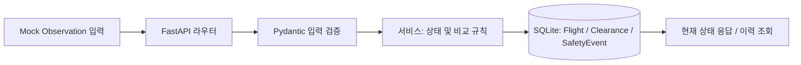

# RADAR 구현 기능 문서

작성일: 2026-10-04 · 앱 버전: 0.1.0

이 문서는 현재 소스 코드에 구현된 P0 Mock 기능을 설명합니다. 저장소 루트는 `Boeing_RADAR/`이며 Python 서버와 해당 테스트는 `backend/`에 있습니다. 이 문서는 백엔드 Mock 기준선입니다. 이후 태블릿 MCP 화면과 Vision 스트림 구현은 [구현 현황](IMPLEMENTATION_STATUS.md) 및 [태블릿 데모 안내](../vision/docs/tablet-demo.md)에 기록합니다.

## 1. 목적과 구현 범위

RADAR는 관제 지시(ATC), 조종사 복명복창(Readback), Cockpit 설정값을 하나의 Clearance에 연결하고 고도(ALT)와 방위(HDG)를 비교하는 Python 기반 PoC입니다.

구현된 기능은 다음과 같습니다.

| 영역 | 구현 내용 |
|---|---|
| Flight Session | 비행 시작, 자동 ID 발급, 조회, 종료 |
| Clearance | ATC 지시 생성, 비행별 목록 및 상세 조회 |
| Observation | ATC·Readback·Cockpit 입력, 입력값 검증, 최신값 저장 |
| 비교 | ALT/HDG 정확 일치 판정, Readback 오류 우선 처리 |
| 재검증 | 오류 상태에서 수정값 입력, 재비교, 오류 해소 기록 |
| Safety Trace | 인식·오류·경보·수정·재검증 이벤트와 입력 스냅샷 저장 |
| API 문서 | Swagger 한국어 설명, 필드 설명, 요청 예시, 오류 응답 |
| 테스트 | 임시 SQLite 기반 API 흐름 및 비교 로직 검증 |

실제 STT, Vision AI, SDR 통신은 연결하지 않습니다. 외부 모듈 대신 JSON Mock 데이터를 API로 입력합니다.

## 2. 구성과 처리 흐름

기술 스택은 Python 3.11+, FastAPI, Pydantic, SQLAlchemy, SQLite, pytest입니다. 하나의 FastAPI 앱 내부에서 동작합니다.



| 경로 | 역할 |
|---|---|
| `backend/app/main.py` | 앱 생성, 라우터 등록, 앱 시작 시 테이블 생성, Swagger 설명 |
| `backend/app/db.py` | DB 연결, 세션 관리, 외래 키 활성화, UTC 시각 생성 |
| `backend/app/core/enums.py` | Flight·Clearance 상태, Source, 이벤트 유형 |
| `backend/app/models/` | SQLAlchemy 저장 모델 |
| `backend/app/schemas/` | 요청 검증 및 응답 명세 |
| `backend/app/api/flights.py` | Flight, 지시 생성·목록, Safety Trace API |
| `backend/app/api/clearances.py` | 지시 상세, Readback·Cockpit 입력 및 재검증 API |
| `backend/app/services/flight_service.py` | 비행 수명주기 처리 |
| `backend/app/services/clearance_service.py` | Observation 연결, 입력 순서, 상태 전이, 이벤트 기록 |
| `backend/app/services/validation_service.py` | ALT/HDG 비교 함수 |
| `backend/app/services/safety_trace_service.py` | 이벤트 저장 및 시간순 조회 |
| `backend/tests/` | 비교 및 API 흐름 테스트 |

## 3. 저장 데이터

### Flight

하나의 비행 세션을 나타냅니다.

| 필드 | 의미 |
|---|---|
| `flight_id` | `FLT-YYYYMMDD-NNN` 형식의 비행 ID |
| `started_at` | 시작 시각 |
| `ended_at` | 종료 시각. 종료 전 `null` |
| `status` | `ACTIVE` 또는 `ENDED` |

ID 날짜는 UTC 시작 날짜입니다. 번호는 SQLite 정수 키를 기반으로 전체 DB에서 증가하며 날짜별로 초기화하지 않습니다. 여러 ACTIVE Flight를 생성할 수 있습니다.

### Clearance

하나의 관제 지시를 나타냅니다. 새 ATC 지시마다 `CLR-NNN` 형식의 새로운 ID를 발급합니다.

| 필드 | 의미 |
|---|---|
| `clearance_id` | 지시 고유 ID |
| `flight_id` | 소속 비행 ID(외래 키) |
| `atc` | ATC Observation |
| `readback` | 최신 Readback Observation. 미입력 시 `null` |
| `cockpit` | 최신 Cockpit Observation. 미입력 시 `null` |
| `status` | 현재 판정 상태 |
| `errors` | 현재 불일치 목록. 오류가 없으면 `[]` |

세 Observation과 errors는 JSON 컬럼으로 저장합니다. 수정 시 최신 Observation을 교체하고 이전 입력은 Safety Trace에 보존합니다. ATC 수정·삭제 API는 없습니다.

### Observation 입력

| 필드 | 필수 | 규칙 |
|---|---|---|
| `altitude` | 예 | 0 이상 정수, 단위 feet |
| `heading` | 예 | 0~359 정수, 단위 degrees |
| `confidence` | 예 | 0~1 숫자 |
| `transcript` | 아니요 | 문자열 또는 `null` |
| `observed_at` | 아니요 | ISO 8601 시각 |

`source`는 API가 ATC, READBACK, COCKPIT 중 하나로 지정합니다. 요청에 추가 필드를 넣으면 거부됩니다. ALT/HDG 중 한 필드만 입력하는 부분 지시는 지원하지 않습니다. confidence는 저장하지만 현재 판정에는 반영하지 않습니다.

모든 시각은 UTC ISO 8601로 저장합니다. `observed_at` 생략 시 서버 시각, 시간대 없는 값은 UTC로 해석합니다. 이벤트 timestamp는 입력된 관측 시각과 별개의 서버 기록 시각입니다.

## 4. 비교 규칙과 상태 전이

1. ATC와 Readback의 ALT/HDG를 먼저 비교합니다.
2. 하나라도 다르면 `READBACK_ERROR`입니다. Cockpit 값과 관계없이 우선 적용합니다.
3. Readback이 일치할 때 Cockpit을 비교합니다.
4. Cockpit이 없으면 `WAITING_COCKPIT`, 다르면 `SETTING_ERROR`, 모두 같으면 `VERIFIED`입니다.

숫자는 정확 일치로 비교합니다. 고도 허용 오차, 0도와 360도의 동치 처리, confidence 임계값은 적용하지 않습니다(입력 heading은 0~359).

| 상황 | 결과 상태 |
|---|---|
| ATC 지시 생성 | `WAITING_READBACK` |
| Readback 불일치 | `READBACK_ERROR` |
| Readback 일치, Cockpit 미입력 | `WAITING_COCKPIT` |
| Readback 일치, Cockpit 불일치 | `SETTING_ERROR` |
| 세 값 일치 | `VERIFIED` |
| 오류 수정 처리 중 | `REVERIFYING` |
| 재검증으로 오류 해소 | `RESOLVED` |

오류 응답 예시:

```json
{
  "status": "READBACK_ERROR",
  "errors": [{"field": "ALT", "expected": 18000, "actual": 16000}]
}
```

### 재검증의 의미

Readback 재검증은 `READBACK_ERROR`, Cockpit 재검증은 `SETTING_ERROR` 상태에서만 가능합니다. 수정값을 저장하고 다시 비교하며 오류가 남으면 오류 상태를 유지합니다.

요구사항 CASE 2에 따라 **Readback 오류 수정은 Cockpit이 없어도 RESOLVED**입니다. 이는 복명복창 오류의 해소를 의미합니다. 이후 최초 Cockpit 입력에 따라 `VERIFIED` 또는 `SETTING_ERROR`로 변경됩니다. 이미 Cockpit이 있으면 수정된 Readback과 함께 비교하여 남은 설정 오류를 판정합니다.

`REVERIFYING`은 동일 트랜잭션 안에서 최종 상태로 바뀝니다. 이 중간 상태는 Safety Trace 이벤트로 확인하며 API 응답에는 최종 상태가 반환됩니다.

## 5. API 명세

기본 주소: `http://localhost:8000`

| 메서드 | 경로 | 동작 | 성공 코드 |
|---|---|---|---|
| POST | `/api/flights/start` | ACTIVE Flight 생성, FLIGHT_STARTED 기록 | 201 |
| POST | `/api/flights/{flight_id}/end` | ENDED 변경, 종료 시각과 FLIGHT_ENDED 기록 | 200 |
| GET | `/api/flights/{flight_id}` | Flight 정보 조회 | 200 |
| POST | `/api/flights/{flight_id}/clearances` | ATC 입력, 새 지시 생성 | 201 |
| GET | `/api/flights/{flight_id}/clearances` | 생성 순서로 지시 목록 조회 | 200 |
| GET | `/api/flights/{flight_id}/safety-trace` | 전체 이벤트 시간순 조회 | 200 |
| GET | `/api/clearances/{clearance_id}` | 지시, 최신 Observation, 상태 및 errors 조회 | 200 |
| POST | `/api/clearances/{clearance_id}/readback` | 최초 Readback 입력·비교 | 200 |
| POST | `/api/clearances/{clearance_id}/cockpit` | 최초 Cockpit 입력·비교 | 200 |
| POST | `/api/clearances/{clearance_id}/readback/reverify` | Readback 오류 수정·재검증 | 200 |
| POST | `/api/clearances/{clearance_id}/cockpit/reverify` | Cockpit 오류 수정·재검증 | 200 |

### 입력 예시

Observation 입력 API는 공통 형식을 사용합니다.

```json
{
  "transcript": "Flight level one eight zero heading two four zero",
  "altitude": 18000,
  "heading": 240,
  "confidence": 0.96,
  "observed_at": "2026-10-04T05:32:02Z"
}
```

Cockpit에서는 transcript를 생략할 수 있습니다. 재검증에도 altitude, heading, confidence를 모두 전달합니다.

### 입력 순서와 오류 응답

| HTTP 코드 | 조건 |
|---|---|
| 404 | Flight 또는 Clearance ID가 없음 |
| 409 | 종료된 Flight에 지시 생성·Observation 변경 요청 |
| 409 | 이미 종료된 Flight를 다시 종료 |
| 409 | Readback 없이 Cockpit 입력 |
| 409 | 이미 존재하는 Readback 또는 Cockpit을 최초 입력 API로 다시 입력 |
| 409 | 재검증 대상 오류 상태가 아닌데 reverify 호출 |
| 422 | 필수 필드 누락, 범위·타입 오류, 알 수 없는 추가 필드 |

종료된 비행도 조회는 가능합니다. Flight 종료는 미해결 Clearance가 있어도 허용하며 Clearance 상태를 자동 변경하지 않습니다. READBACK_ERROR 상태에서도 Readback이 존재하면 최초 Cockpit 입력은 가능하고 판정은 READBACK_ERROR가 우선입니다.

## 6. Safety Trace

결과 하나를 덮어쓰는 대신 이벤트를 누적합니다.

| 필드 | 의미 |
|---|---|
| `id` | 이벤트 고유 번호 |
| `flight_id` | 소속 Flight |
| `clearance_id` | 관련 Clearance. 비행 시작·종료는 `null` |
| `event_type` | 이벤트 유형 |
| `field` | ALT/HDG 또는 `null` |
| `expected` | 오류 기준값 또는 수정 전 값 |
| `actual` | 실제값 또는 수정 후 값 |
| `timestamp` | 서버 기록 시각 |
| `observation` | 입력 당시 Observation 스냅샷 또는 `null` |

이벤트 종류: `FLIGHT_STARTED`, `ATC_RECOGNIZED`, `READBACK_RECOGNIZED`, `COCKPIT_RECOGNIZED`, `READBACK_ERROR`, `SETTING_ERROR`, `ALERTED`, `READBACK_UPDATED`, `COCKPIT_UPDATED`, `REVERIFYING`, `VERIFIED`, `RESOLVED`, `FLIGHT_ENDED`.

- 오류는 불일치 필드마다 기록하고 해당 판정에 ALERTED 이벤트 하나를 추가합니다.
- 수정은 전체 Observation 스냅샷 이벤트와 변경된 ALT/HDG 필드별 이벤트를 기록합니다. 따라서 같은 UPDATED 유형이 여러 번 나타날 수 있습니다.
- 변경된 필드가 없어도 재검증 입력 스냅샷은 기록합니다.
- 조회는 timestamp 오름차순, 동일 timestamp는 id 오름차순입니다.
- 데이터 변경과 해당 이벤트는 동일 트랜잭션으로 커밋됩니다.
- ALERTED는 이력 기록이며 외부 알림이나 Cockpit 경보 장치 연동은 아닙니다.

Cockpit ALT 오류 수정 예시:

```text
FLIGHT_STARTED
ATC_RECOGNIZED
READBACK_RECOGNIZED
COCKPIT_RECOGNIZED
SETTING_ERROR (ALT: expected=18000, actual=16000)
ALERTED
REVERIFYING
COCKPIT_UPDATED (수정 Observation 스냅샷)
COCKPIT_UPDATED (ALT: expected=16000, actual=18000)
RESOLVED
FLIGHT_ENDED
```

## 7. 실행과 데모

저장소 루트에서 `backend/`로 이동해 실행합니다.

```sh
cd backend
python3 -m venv .venv
source .venv/bin/activate
pip install -r requirements.txt
uvicorn app.main:app --reload
```

`backend/`에서 실행할 때 기본 DB는 `backend/radar.db`이며 앱 시작 시 테이블을 생성합니다. 다른 경로를 쓰려면 실행 전에 `RADAR_DATABASE_URL`을 지정합니다.

```sh
export RADAR_DATABASE_URL=sqlite:///./demo.db
uvicorn app.main:app --reload
```

Swagger: http://localhost:8000/docs · OpenAPI JSON: http://localhost:8000/openapi.json

| 시나리오 | ATC ALT/HDG | Readback | Cockpit | 예상 결과 |
|---|---|---|---|---|
| 정상 | 18000/240 | 18000/240 | 18000/240 | VERIFIED |
| 복명복창 오류 | 18000/240 | 16000/240 → 18000/240 | 미입력 | READBACK_ERROR → RESOLVED |
| 설정 오류 | 18000/240 | 18000/240 | 16000/240 → 18000/240 | SETTING_ERROR → RESOLVED |

Swagger에서 Flight 시작 → ATC 생성 → 반환된 clearance_id로 Readback/Cockpit 입력 → 오류 시 reverify → Safety Trace 조회 → Flight 종료 순서로 실행합니다. 세 시나리오를 자동 호출하는 HTTP 데모 스크립트는 [README](../README.md#mock-demo--api-테스트)에 있습니다.

## 8. 검증 현황

아래 명령은 `backend/`에서 실행합니다.

```sh
.venv/bin/python -m pytest -q
```

2026-10-04 검증 결과: **17 passed, 1 warning**. 경고는 Starlette TestClient의 httpx 사용에 관한 deprecation 경고입니다.

테스트는 임시 SQLite DB로 실행되며 다음을 검증합니다.

- Flight 생성·조회·종료 및 종료 후 변경 거부
- 정상 VERIFIED 흐름
- Readback/Cockpit 각각 ALT 및 HDG 오류
- 두 오류 유형의 수정 후 RESOLVED
- Readback 우선 비교와 Cockpit 오류로의 전환
- 이벤트 순서와 수정 전후 Observation 보존
- 서로 다른 Clearance 간 데이터 분리
- 최초 입력 중복, 입력 순서, 잘못된 재검증 거부
- 입력 범위, 정수 타입, 추가 필드 검증

OpenAPI 생성 시 11개 API의 설명과 Observation 요청 예시가 포함되는 것도 확인했습니다. 테스트는 FastAPI TestClient로 API를 호출하며 실제 항공 장비와의 연동 검증은 포함하지 않습니다.

## 9. 미구현 및 확장 항목

| 항목 | 현재 상태 |
|---|---|
| STT·Vision AI·SDR | 미연결. 같은 Observation API로 연결 가능 |
| 오차별 CAUTION/WARNING/CRITICAL | 미구현 |
| Communication Uncertainty | 미구현 |
| Sensor Cross-Check | 미구현 |
| 외부 경보 전송 | 미구현. ALERTED 이벤트만 저장 |
| 인증·권한 | 미구현 |
| DB 마이그레이션 | 미구현. 시작 시 테이블 생성만 수행 |
| 병렬 변경 충돌 제어 | 미구현 |
| Flight 전체 목록·삭제, ATC 수정 | API 미제공 |

현재 산출물은 Mock 기반 P0 기능 검증을 위한 PoC입니다.
