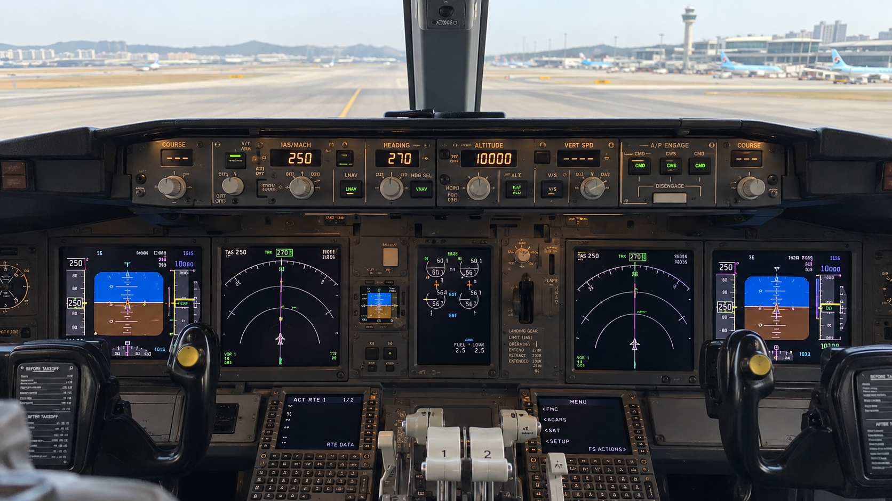
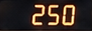
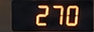
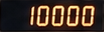
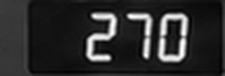

# MCP Vision PoC — 사진·결과·실행 안내

2026-10-10 · 1주차 정지 이미지 PoC. 사용자 제공 참고 사진을 문서에 포함하고, 실제 OCR 실행 결과와 근거를 보존했다. 실제 카메라 연결·연속 촬영·백엔드 전송은 아직 구현하지 않았다.

## 촬영 구도와 인식 대상



두 조종석 사이 뒤쪽 고정 지지대에서 전방 MCP를 약간 아래로 촬영한다. IAS/MACH·HEADING·ALTITUDE 숫자 창이 대상이다. 조종사 시야·조종간·좌석 이동·비상 탈출 동선을 방해하지 않는 위치가 설치 원칙이다. 사진은 촬영 구도 참고이며 실제 설치 완료를 의미하지 않는다. 세부 ROI와 설치 기준은 [카메라 문서](../../vision/docs/camera-setup.md)에 있다.

## 실제 사진 실행 결과

| 표시창 | 수동 정답 | OCR 결과 | 원본 영역 |
| --- | --- | --- | --- |
| IAS/MACH | 250 | 250 knots |  |
| HEADING | 270 | 270 degrees |  |
| ALTITUDE | 10000 | 10000 feet |  |

초기 방위 인식은 OL2로 실패했다. 방위 ROI만 흑백 변환하고 Lanczos로 4배 확대하여 숫자 치환 없이 OCR 원문 270을 읽었다. 속도·고도는 원본 영역을 사용한다. 아래는 OCR에 실제 전달한 방위 이미지다.



모든 창에 같은 전처리를 적용하면 속도가 052로 잘못 읽혀 채택하지 않았다. 모델 점수는 정확도가 아니며, 이 사진은 설정 조정에 사용한 샘플이다. 다른 값·각도·실제 카메라 성능을 입증하는 독립 평가 결과는 아니다.

## 결과 JSON 읽기

[이번 결과 JSON](../../contracts/examples/mcp-observation.json)에는 실제 실행의 숫자·점수·시각·ROI가 있다. 근거 경로는 팀원이 열 수 있도록 저장소의 문서 자산 위치로 바꿨다. 경로 기준은 저장소 루트다.

- 실행 정보: schema_version/source/input_mode/frame_id.
- 시각: captured_at는 미상 null, processed_at는 처리 완료 UTC 시각. 촬영 시각을 처리 시각으로 대신하지 않는다.
- fields: altitude/heading/speed별 value·unit·raw_text·model_score·reason·roi·contrast_stddev·evidence.
- 방위 전처리: ocr_evidence와 ocr_preprocessing에 실제 입력과 처리 방법 기록.
- evidence: 전체 참고 사진 경로.

타입·실패 사유·null/0·점수 해석·기존 서버와의 차이는 [JSON 명세](../../contracts/vision-poc.md)에 정리했다. 현재 결과에는 관제 지시와 비교한 정상/오류 판정이 없다.

## 팀원 재현 방법

저장소 루트에서 실행한다. Python 3.11 이상과 macOS Command Line Tools가 필요하다.

```sh
python3 -m venv vision/.venv
vision/.venv/bin/python -m pip install -e './vision[test]'
mkdir -p vision/.build
xcrun swiftc vision/native/ocr.swift -o vision/.build/radar-ocr
vision/.venv/bin/radar-vision docs/vision/assets/mcp-reference.png --config vision/configs/mcp-fixed-camera.json --ocr-binary vision/.build/radar-ocr --output-dir vision/output
vision/.venv/bin/python -m pytest vision/tests -q
```

기대값은 altitude=10000, heading=270, speed=250이다. 모델 점수는 엔진/OS에 따라 달라질 수 있다. 원본·잘라낸 영역·JSON은 output의 실행 ID별 폴더에 생성된다.

## 검증과 보관 범위

자동 테스트 29개 통과, 기존 합성 고정 기대 사례 5개 회귀 통과, 참고 사진 세 값의 실제 OCR·수동 대조 완료. [상세 기록](../../vision/evaluation/README.md)을 참고한다.

문서에는 사진 1개·영역 3개·방위 OCR 입력 1개·JSON 예제만 보존했다. 중간 실험과 중복 전체 프레임은 vision/output에서 제거했다. output은 Git에 포함하지 않으며 다시 실행하면 생성된다. 실제 촬영 영상이나 장기 로그를 저장하는 정책은 아직 없다.
